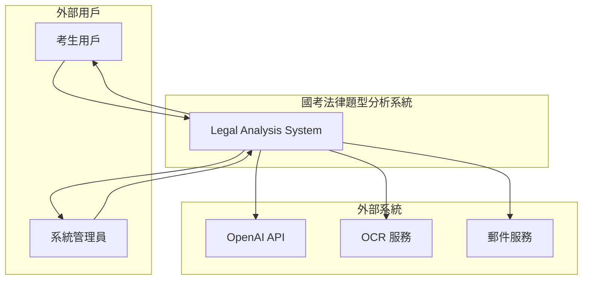
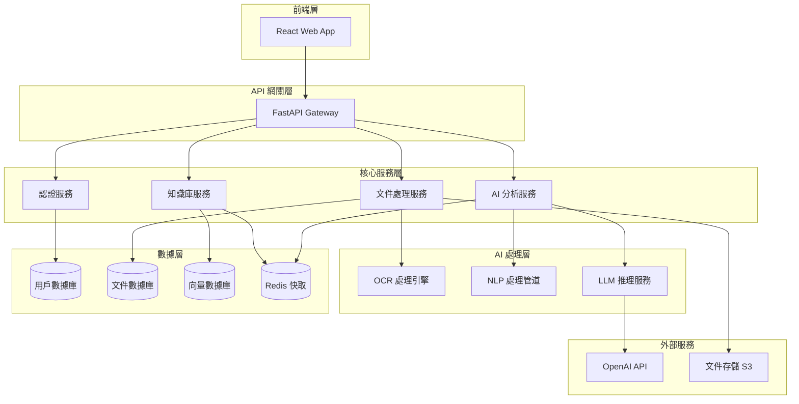
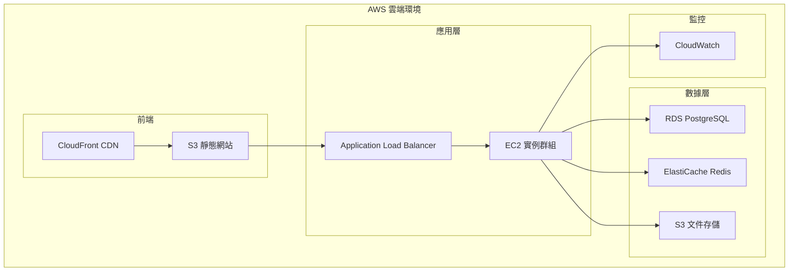

# 系統架構設計文檔 (System Architecture Document) - 國考法律題型分析系統

---

**文件版本 (Document Version):** `v1.0`

**最後更新 (Last Updated):** `2025-08-17`

**主要作者/架構師 (Lead Author/Architect):** `技術負責人`

**審核者 (Reviewers):** `架構審查委員會、產品經理、AI 工程師`

**狀態 (Status):** `草稿 (Draft)`

**相關 PRD/專案簡報:** `[docs/planning/project_brief_prd_summary.md]`

**相關 ADRs:** `[將在實施過程中建立]`

---

## 目錄 (Table of Contents)

1.  [引言 (Introduction)](#1-引言-introduction)
2.  [架構目標與原則 (Architecture Goals and Principles)](#2-架構目標與原則-architecture-goals-and-principles)
3.  [需求摘要 (Requirements Summary)](#3-需求摘要-requirements-summary)
4.  [高層次架構設計 (High-Level Architectural Design)](#4-高層次架構設計-high-level-architectural-design)
5.  [技術選型詳述 (Technology Stack Details)](#5-技術選型詳述-technology-stack-details)
6.  [數據架構 (Data Architecture)](#6-數據架構-data-architecture)
7.  [部署與基礎設施架構 (Deployment and Infrastructure Architecture)](#7-部署與基礎設施架構-deployment-and-infrastructure-architecture)
8.  [跨領域考量 (Cross-Cutting Concerns)](#8-跨領域考量-cross-cutting-concerns)
9.  [風險與緩解策略 (Risks and Mitigation)](#9-風險與緩解策略-risks-and-mitigation)
10. [架構演進路線圖 (Architecture Evolution Roadmap)](#10-架構演進路線圖-architecture-evolution-roadmap)

---

## 1. 引言 (Introduction)

### 1.1 目的與範圍 (Purpose and Scope)
*   **目的 (Purpose):** 為國考法律題型分析系統提供一個清晰、一致的高層次架構藍圖，定義其主要組件、交互方式和技術選型，以指導後續的詳細設計和開發實施。
*   **範圍 (Scope):** 本架構文檔涵蓋從用戶前端到 AI 後端的完整系統邊界，包括 PDF 處理、OCR 引擎、法條知識庫、AI 分析引擎、知識圖譜生成等核心功能模組。不包括第三方支付系統整合和進階會員功能。

### 1.2 業務背景與價值 (Business Context and Value)
*   **業務問題/機會 (Business Problem/Opportunity):** 目前準備國考法律科目的考生面臨法條難懂、題型解析耗時的痛點，市場缺乏結合 AI 技術的智慧化法律學習工具。
*   **預期業務價值 (Expected Business Value):** 預計能將考生單題分析時間從 30 分鐘縮短至 3 分鐘，提升學習效率 10 倍，目標在第一年內獲取 5000 名活躍用戶。
*   **與公司戰略的關聯 (Alignment with Company Strategy):** 支持公司進入教育科技市場的戰略，建立 AI 驅動的垂直領域解決方案。

### 1.3 目標讀者 (Target Audience)
*   專案開發團隊、架構師、產品經理、AI 工程師、DevOps 團隊、QA 測試團隊

### 1.4 術語表 (Glossary)
| 術語/縮寫 | 完整名稱/解釋 |
| :------- | :----------- |
| `RAG` | `Retrieval-Augmented Generation，檢索增強生成` |
| `OCR` | `Optical Character Recognition，光學字符識別` |
| `LLM` | `Large Language Model，大型語言模型` |
| `NLP` | `Natural Language Processing，自然語言處理` |
| `pgvector` | `PostgreSQL 的向量擴展，支持向量相似性搜索` |
| `TPS` | `Transactions Per Second，每秒交易數` |

---

## 2. 架構目標與原則 (Architecture Goals and Principles)

### 2.1 業務目標 (Business Goals)
*   `目標 1: 達到 5000 名月活躍用戶 (MAU)，驗證產品市場契合度`
*   `目標 2: 實現 90% 的功能成功率，確保用戶體驗流暢`
*   `目標 3: 建立可擴展的技術架構，支持未來 10 倍用戶增長`

### 2.2 架構目標 (Architectural Goals / Quality Attributes)
*   **可擴展性 (Scalability):** 系統能夠水平擴展以應對用戶增長，支持從百人到萬人級別的使用量。
*   **高可用性 (High Availability):** 核心服務的可用性需達到 95%，確保用戶學習不中斷。
*   **可維護性 (Maintainability):** 模塊化設計，降低耦合度，支持快速功能迭代和 bug 修復。
*   **成本效益 (Cost-Effectiveness):** 在滿足性能目標的前提下，優化基礎設施成本，適合初創階段。
*   **AI 準確性 (AI Accuracy):** AI 分析結果準確率達到 85% 以上，提供可信賴的學習建議。

### 2.3 設計原則 (Design Principles)
*   **API 優先 (API-First):** 所有功能都通過定義良好的 RESTful API 暴露，便於前後端分離和未來擴展。
*   **數據驅動決策 (Data-Driven):** 建立完整的用戶行為追蹤和分析能力，支持產品決策。
*   **AI 為核心 (AI-Centric):** 系統架構圍繞 AI 分析能力設計，優化 AI 工作流的性能和準確性。
*   **漸進式複雜度 (Progressive Complexity):** 從 MVP 開始，支持功能的漸進式增加而不需要重大架構重構。
*   **安全優先 (Security-First):** 從設計之初就考慮用戶數據保護和系統安全。

### 2.4 設計權衡 (Design Trade-offs)
*   **`權衡點 1: 性能 vs. 成本`:** 選擇託管資料庫服務 (PostgreSQL on AWS RDS) 而非自建，雖然成本較高，但為了確保 <5 秒的響應時間和減少運維複雜度，這是必要的投資。
*   **`權衡點 2: 準確性 vs. 響應速度`:** 在 AI 分析中，我們選擇了準確性優先的策略，允許 30 秒的分析時間來獲得更高品質的結果，而非追求即時回應。
*   **`權衡點 3: 技術一致性 vs. 最佳工具`:** 雖然團隊主要使用 Python，但為了 OCR 性能我們考慮整合專業的 OCR 服務，接受技術棧的多樣性來獲得更好的功能表現。

### 2.5 主要制約因素與假設 (Key Constraints and Assumptions)
*   **制約因素 (Constraints):** 
    - 初期預算限制，需要在 AWS/GCP 上控制月度成本在 $1000 以內
    - 團隊規模小（3-5 人），需要選擇學習成本低的技術棧
    - 必須符合台灣個資法規範，確保用戶數據安全
*   **假設 (Assumptions):** 
    - OpenAI/Anthropic API 服務穩定可用，成本在可接受範圍
    - 用戶主要使用繁體中文，OCR 和 NLP 需針對中文優化
    - 法條資料來源合法且可公開使用

---

## 3. 需求摘要 (Requirements Summary)

### 3.1 功能性需求摘要 (Functional Requirements Summary)
*   `FR-1: 用戶身份驗證與管理` (對應 US-101)
*   `FR-2: PDF 文件上傳與 OCR 處理` (對應 US-102)
*   `FR-3: AI 驅動的法律題型分析` (對應 US-201)
*   `FR-4: 法條知識庫檢索` (對應 US-202)
*   `FR-5: 知識圖譜生成與可視化` (對應 US-301)
*   `FR-6: 學習歷史記錄管理` (對應 US-302)

### 3.2 非功能性需求 (Non-Functional Requirements - NFRs)

| NFR 分類 | 具體需求描述 | 衡量指標/目標值 |
| :--------------- | :----------------------------------------------------------- | :---------------------------------------- |
| **性能 (Performance)** | API 端點 P95 延遲 | `< 5 秒 (一般 API), < 30 秒 (AI 分析)` |
| | OCR 處理性能 | `< 10 秒/頁` |
| **可擴展性 (Scalability)** | 支持併發用戶數 | `100 併發用戶` |
| | 資料庫查詢性能 | `向量搜索 < 2 秒` |
| **可用性 (Availability)** | 系統可用性 (SLA) | `95%` |
| **可靠性 (Reliability)** | 端到端功能成功率 | `90%` |
| | AI 分析準確率 | `85%` |
| **安全性 (Security)** | 數據傳輸加密標準 | `HTTPS/TLS 1.3` |
| | 身份驗證機制 | `JWT with bcrypt password hashing` |
| **合規性 (Compliance)** | 個人資料保護 | `符合台灣個資法要求` |

---

## 4. 高層次架構設計 (High-Level Architectural Design)

### 4.1 選定的架構模式 (Chosen Architectural Pattern)
*   **模式:** `微服務架構 (Microservices) + 事件驅動架構 (Event-Driven Architecture)`
*   **選擇理由:** 微服務架構允許不同功能模組獨立開發和部署，特別適合 AI 處理和傳統 Web 服務的分離。事件驅動設計支持異步處理，提升用戶體驗，並且便於未來功能擴展。相比單體架構，雖然增加了複雜度，但提供了更好的可擴展性和技術選型靈活性。

### 4.2 系統上下文圖 (System Context Diagram)



### 4.3 系統組件圖 (System Component Diagram)



### 4.4 主要組件/服務職責 (Key Components/Services Responsibilities)

| 組件/服務名稱 | 核心職責 | 主要技術/框架 | 依賴 |
| :-------------------- | :-------------------------------------------------------- | :------------------- | :-------------------- |
| `React Web App` | `用戶界面，文件上傳，結果展示，數據可視化` | `React 18, TypeScript, Ant Design` | `API Gateway` |
| `FastAPI Gateway` | `API 路由，請求驗證，響應格式化，錯誤處理` | `FastAPI, Pydantic` | `各微服務` |
| `認證服務` | `用戶註冊登入，JWT Token 管理，權限控制` | `FastAPI, JWT, bcrypt` | `UserDB` |
| `文件處理服務` | `PDF 上傳，OCR 處理，文本預處理，文件管理` | `FastAPI, PyMuPDF, PaddleOCR` | `DocumentDB, Storage` |
| `AI 分析服務` | `題型分析，法條匹配，學習建議生成` | `FastAPI, LangChain, OpenAI` | `LLM Service, VectorDB` |
| `知識庫服務` | `法條檢索，向量搜索，知識圖譜生成` | `FastAPI, pgvector, NetworkX` | `VectorDB, CacheDB` |

### 4.5 關鍵用戶旅程與組件交互 (Key User Journeys and Component Interactions)

*   **場景 1: 用戶註冊流程**
    1.  **用戶** 通過 **React Web App** 提交註冊信息
    2.  **API Gateway** 驗證請求格式，路由到 **認證服務**
    3.  **認證服務** 驗證郵箱唯一性，加密密碼，寫入 **用戶數據庫**
    4.  **認證服務** 生成 JWT Token 並返回給用戶

*   **場景 2: PDF 上傳與分析流程**
    1.  **用戶** 通過 **Web App** 上傳 PDF 考題文件
    2.  **API Gateway** 驗證用戶身份，將請求路由到 **文件處理服務**
    3.  **文件處理服務** 將 PDF 存儲到 **S3**，調用 **OCR 引擎** 提取文字
    4.  **文件處理服務** 將處理結果存儲到 **文件數據庫**，通知 **AI 分析服務**
    5.  **AI 分析服務** 調用 **NLP 管道** 預處理文本，使用 **LLM 服務** 進行分析
    6.  **AI 分析服務** 調用 **知識庫服務** 檢索相關法條，生成綜合分析結果
    7.  分析結果返回給用戶，並緩存到 **Redis** 以提升後續查詢性能

---

## 5. 技術選型詳述 (Technology Stack Details)

### 5.1 技術選型原則 (Technology Selection Principles)
*   **優先選擇託管服務 (Prefer Managed Services):** 盡可能使用雲端供應商提供的託管服務，降低運維複雜度和初期成本。
*   **基於團隊現有技能 (Align with Team Expertise):** 在滿足需求的前提下，優先選擇團隊熟悉的 Python 生態系統。
*   **擁抱成熟的 AI 生態 (Embrace Mature AI Ecosystem):** 選擇有豐富文檔和社群支持的 AI/ML 工具。
*   **考慮總體擁有成本 (Consider TCO):** 評估包括開發、部署、運維的全生命週期成本。

### 5.2 技術棧詳情 (Technology Stack Breakdown)

| 分類 | 選用技術 | 選擇理由 (Justification) | 考量的備選方案 (Alternatives) | 風險/成熟度 |
| :--- | :--- | :--- | :--- |:--- |
| **前端框架** | `React 18 + TypeScript` | `React 生態成熟，TypeScript 提供類型安全，團隊熟悉度高` | `Vue.js: 學習曲線較平緩，但生態相對較小` | `成熟 (Mature)` |
| **後端框架** | `Python FastAPI` | `高性能異步框架，自動 API 文檔生成，與 AI 生態集成良好` | `Django: 功能豐富但較重，Flask: 輕量但需要更多配置` | `成熟 (Mature)` |
| **資料庫** | `PostgreSQL + pgvector` | `支持向量搜索，事務一致性強，適合結構化和向量數據共存` | `MongoDB + Atlas Search: 適合非結構化數據，但缺乏事務支持` | `成熟 (Mature)` |
| **快取** | `Redis` | `高性能 key-value 存儲，支持多種數據結構` | `Memcached: 更簡單但功能有限` | `成熟 (Mature)` |
| **AI/ML** | `OpenAI API + LangChain` | `GPT-4 在中文理解上表現優異，LangChain 簡化 RAG 實現` | `Anthropic Claude: 替代方案，HuggingFace: 開源但需要自部署` | `成熟 (Mature)` |
| **OCR** | `PaddleOCR + 雲端 OCR 服務` | `PaddleOCR 對中文支持好且免費，雲端服務作為備份` | `Google Vision API: 準確率高但成本較高` | `成熟 (Mature)` |
| **容器化** | `Docker + Docker Compose` | `簡化部署和環境一致性，成本控制階段暫不使用 K8s` | `Kubernetes: 功能強大但複雜度高，適合後期擴展` | `成熟 (Mature)` |
| **雲端平台** | `AWS` | `服務豐富，託管服務成熟，與 AI 服務集成良好` | `GCP: AI 服務優勢，Azure: 微軟生態` | `成熟 (Mature)` |

---

## 6. 數據架構 (Data Architecture)

### 6.1 數據模型 (Data Models)

```sql
-- 用戶管理
CREATE TABLE users (
    id UUID PRIMARY KEY DEFAULT gen_random_uuid(),
    email VARCHAR(255) UNIQUE NOT NULL,
    hashed_password VARCHAR(255) NOT NULL,
    full_name VARCHAR(255),
    subscription_type VARCHAR(20) DEFAULT 'free',
    created_at TIMESTAMP DEFAULT NOW(),
    updated_at TIMESTAMP DEFAULT NOW()
);

-- 文件管理
CREATE TABLE documents (
    id UUID PRIMARY KEY DEFAULT gen_random_uuid(),
    user_id UUID REFERENCES users(id),
    filename VARCHAR(255) NOT NULL,
    file_type VARCHAR(50),
    file_size INTEGER,
    storage_path VARCHAR(500),
    processing_status VARCHAR(20) DEFAULT 'uploaded',
    ocr_text TEXT,
    created_at TIMESTAMP DEFAULT NOW()
);

-- 法條知識庫
CREATE TABLE legal_articles (
    id UUID PRIMARY KEY DEFAULT gen_random_uuid(),
    article_code VARCHAR(100) NOT NULL,
    title TEXT,
    content TEXT,
    category VARCHAR(100),
    source_law VARCHAR(100),
    embedding VECTOR(1536), -- OpenAI embeddings
    frequency_score FLOAT DEFAULT 0,
    created_at TIMESTAMP DEFAULT NOW()
);

-- 分析結果
CREATE TABLE question_analyses (
    id UUID PRIMARY KEY DEFAULT gen_random_uuid(),
    document_id UUID REFERENCES documents(id),
    user_id UUID REFERENCES users(id),
    question_text TEXT,
    question_type VARCHAR(100),
    difficulty_level VARCHAR(20),
    analysis_result JSONB,
    related_articles JSONB,
    created_at TIMESTAMP DEFAULT NOW()
);

-- 創建向量索引
CREATE INDEX ON legal_articles USING ivfflat (embedding vector_cosine_ops);
```

### 6.2 數據流圖 (Data Flow Diagrams - DFDs)

**PDF 處理數據流:**
```
用戶上傳 PDF → 文件存儲 (S3) → OCR 處理 → 提取文字 → 存儲到文件數據庫 → 觸發 AI 分析
```

**AI 分析數據流:**
```
文字內容 → NLP 預處理 → 向量化 → 知識庫檢索 → LLM 分析 → 結果生成 → 用戶展示
```

### 6.3 數據一致性策略 (Data Consistency Strategy)
*   **需要強一致性的場景:** 用戶認證信息、文件所有權 → 使用 PostgreSQL 事務保證
*   **可接受最終一致性的場景:** 分析結果快取、統計數據 → 通過異步處理實現

### 6.4 數據生命週期與合規 (Data Lifecycle and Compliance)
*   **數據分類:** 公開數據（法條）、用戶數據（分析歷史）、敏感數據（認證信息）
*   **數據儲存與加密:** 敏感數據庫連接使用 SSL，用戶密碼使用 bcrypt 雜湊
*   **數據保留策略:** 分析結果保留 1 年，用戶可要求刪除，系統日誌保留 30 天
*   **合規性考量:** 遵循台灣個資法，提供用戶數據匯出和刪除功能

---

## 7. 部署與基礎設施架構 (Deployment and Infrastructure Architecture)

### 7.1 部署視圖 (Deployment View)



### 7.2 CI/CD 流程 (CI/CD Pipeline)
*   **代碼提交** → **GitHub Actions 觸發** → **單元測試** → **構建 Docker 映像** → **部署到測試環境** → **集成測試** → **部署到生產環境**

### 7.3 環境策略 (Environment Strategy)
*   **Development:** 本地 Docker Compose，使用 SQLite 和本地 Redis
*   **Staging:** AWS 上的簡化版本，共享 RDS 實例
*   **Production:** 完整的 AWS 部署，獨立資源

### 7.4 成本效益分析 (Cost-Effectiveness Analysis)
*   **主要成本驅動因素:** EC2 實例 (~$200/月)、RDS PostgreSQL (~$150/月)、OpenAI API (~$300/月)
*   **成本估算模型:** 基於 1000 活躍用戶，每月預估成本約 $800
*   **成本優化策略:** 使用 Spot 實例、自動縮放、CDN 快取、API 調用優化

---

## 8. 跨領域考量 (Cross-Cutting Concerns)

### 8.1 可觀測性 (Observability)
*   **日誌 (Logging):** 結構化 JSON 日誌，使用 Python logging 模組，集中到 CloudWatch
*   **指標 (Metrics):** API 響應時間、錯誤率、OCR 處理時間、AI 分析成功率
*   **追蹤 (Tracing):** 使用 FastAPI 內建 middleware 追蹤請求鏈路
*   **告警 (Alerting):** 錯誤率 >5%、響應時間 >10 秒、系統可用性 <95% 時觸發告警

### 8.2 安全性與隱私 (Security and Privacy)
*   **威脅模型:** 主要防範 SQL 注入、XSS 攻擊、未授權數據訪問
*   **認證與授權:** JWT Token 驗證，用戶只能訪問自己的數據
*   **機密管理:** 使用 AWS Secrets Manager 存儲 API 金鑰和資料庫密碼
*   **網路安全:** VPC 隔離、安全組規則、強制 HTTPS
*   **隱私設計:** 數據最小化原則，用戶可刪除個人數據，不存儲敏感個人信息

---

## 9. 風險與緩解策略 (Risks and Mitigation)

| 風險類別 | 風險描述 | 可能性 (高/中/低) | 影響程度 (高/中/低) | 緩解策略 |
| :------- | :------- | :---------------- | :---------------- | :------- |
| **技術風險** | `OpenAI API 服務中斷或價格大幅上漲` | 中 | 高 | `建立多 LLM 供應商備案，實施 API 調用優化和快取策略` |
| **性能風險** | `OCR 處理速度不達標，影響用戶體驗` | 中 | 中 | `測試多種 OCR 引擎，實施異步處理和進度提示` |
| **數據風險** | `法條資料庫不完整或版權問題` | 低 | 高 | `使用官方公開法規資料，建立法律審查流程` |
| **擴展風險** | `用戶增長超出系統承載能力` | 中 | 中 | `實施監控和自動擴展，提前制定擴容計畫` |

---

## 10. 架構演進路線圖 (Architecture Evolution Roadmap)

*   **Phase 1 (MVP - 3 個月):** 實現核心功能的單體部署，驗證產品市場契合度
    - 優先保證功能完整性和用戶體驗
    - 使用簡化的部署架構 (Docker Compose)
    
*   **Phase 2 (擴展期 - 6-12 個月):** 微服務拆分和性能優化
    - 將 AI 處理服務獨立部署，支持更高並發
    - 引入專業的監控和告警系統
    - 實施自動化測試和部署流程
    
*   **Phase 3 (成熟期 - 1 年後):** 企業級功能和多地部署
    - 考慮 Kubernetes 部署以支持更大規模
    - 實施多地區部署提升用戶體驗
    - 探索邊緣計算以降低 AI 處理延遲

---

**文件審核記錄 (Review History):**

| 日期       | 審核人     | 版本 | 變更摘要/主要反饋 |
| :--------- | :--------- | :--- | :---------------- |
| 2025-08-17 | 技術負責人 | v1.0 | 初稿完成，基於 MVP Tech Spec 詳細展開 |