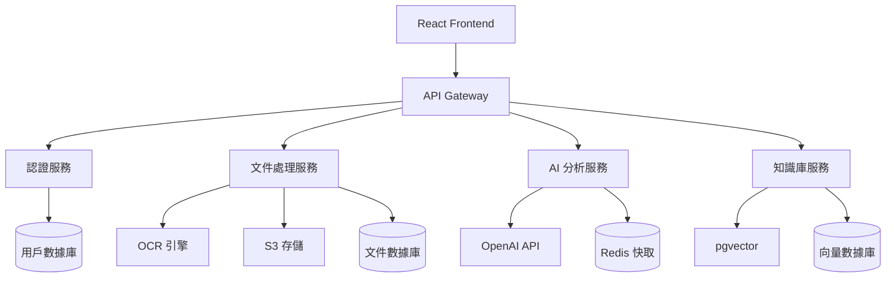
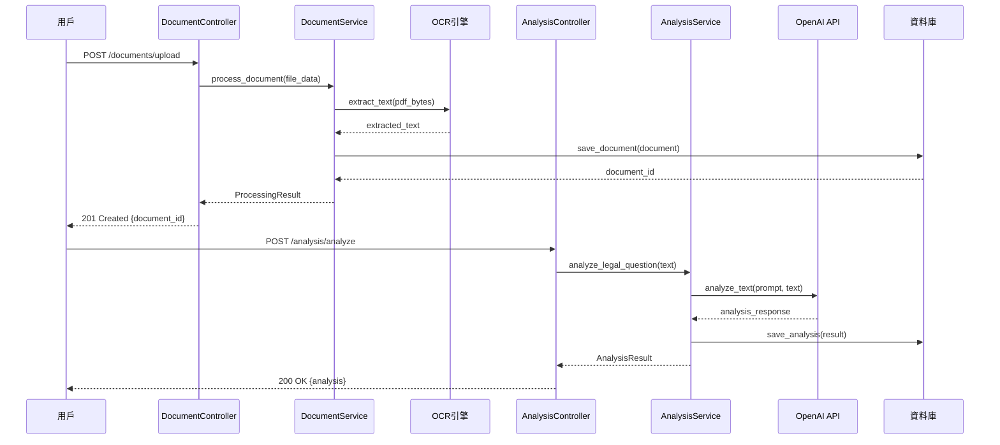
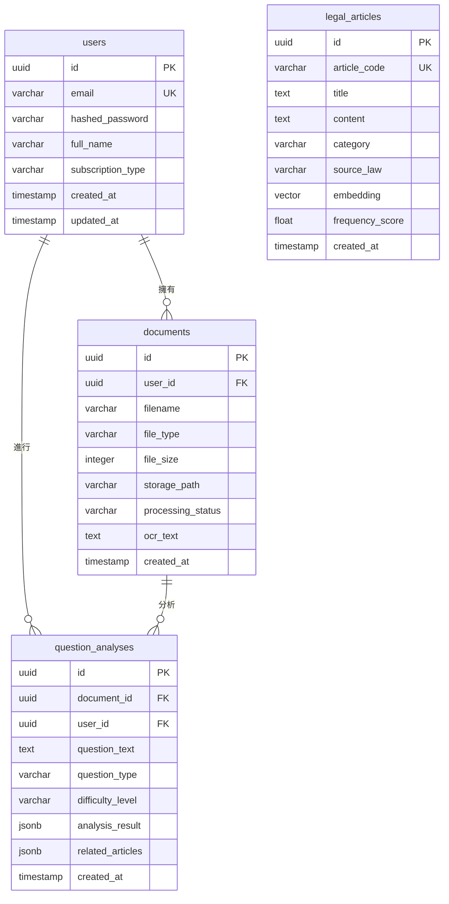

# 系統詳細設計文檔 (System Design Document) - 國考法律題型分析系統核心模組

---

**文件版本 (Document Version):** `v1.0`

**最後更新 (Last Updated):** `2025-08-17`

**主要作者/設計師 (Lead Author/Designer):** `技術負責人、AI 工程師`

**審核者 (Reviewers):** `架構師、產品經理、開發團隊`

**狀態 (Status):** `草稿 (Draft)`

**相關系統架構文檔 (SA Document):** `[docs/architecture/system_architecture_document.md]`

**相關 User Stories/Features:** `PDF 上傳處理 (US-102)、AI 題型分析 (US-201)、法條知識庫檢索 (US-202)`

**相關 API 設計規範:** `[將在後續建立 API 設計規範文檔]`

---

## 目錄 (Table of Contents)

1.  [引言 (Introduction)](#1-引言-introduction)
2.  [模組/功能概述 (Module/Feature Overview)](#2-模組功能概述-modulefeature-overview)
3.  [詳細設計 (Detailed Design)](#3-詳細設計-detailed-design)
4.  [數據庫設計 (Database Design)](#4-數據庫設計-database-design)
5.  [模組邊界與 API 設計 (Module Boundaries and API Design)](#5-模組邊界與-api-設計-module-boundaries-and-api-design)
6.  [跨領域考量 (Cross-Cutting Concerns)](#6-跨領域考量-cross-cutting-concerns)
7.  [測試策略 (Testing Strategy)](#7-測試策略-testing-strategy)
8.  [部署與運維考量 (Deployment and Operations)](#8-部署與運維考量-deployment-and-operations)

---

## 1. 引言 (Introduction)

### 1.1 目的 (Purpose)
*   為國考法律題型分析系統的核心模組提供具體的、可執行的實現藍圖，作為開發、測試和程式碼審查的主要依據。

### 1.2 範圍 (Scope)
*   本文件涵蓋四個核心模組：文件處理服務、AI 分析服務、知識庫服務、用戶認證服務的詳細設計。不包含前端 React 應用和外部第三方服務的詳細實現。

### 1.3 設計目標與非目標 (Goals and Non-Goals)
*   **設計目標 (Goals):**
    *   `目標 1: 實現高性能的 PDF 處理流程，單頁 OCR 處理時間低於 10 秒`
    *   `目標 2: 設計可擴展的 AI 分析架構，支持未來多種 LLM 模型切換`
    *   `目標 3: 確保用戶數據安全，所有敏感信息採用加密存儲`
    *   `目標 4: 建立穩健的錯誤處理機制，系統整體可用性達 95%`
*   **非目標 (Non-Goals):**
    *   `非目標 1: 本次設計不包含進階會員功能和付費機制`
    *   `非目標 2: 不支持即時協作或多用戶同時編輯功能`
    *   `非目標 3: 暫不考慮移動端原生應用的 API 優化`

---

## 2. 模組/功能概述 (Module/Feature Overview)

### 2.1 功能描述 (Functional Description)
*   **文件處理服務 (Document Service):** 負責 PDF 文件上傳、OCR 文字識別、文本預處理和存儲管理
*   **AI 分析服務 (Analysis Service):** 執行法律題型分析、考點識別、學習建議生成等 AI 驅動功能
*   **知識庫服務 (Knowledge Service):** 管理法條數據、執行向量搜索、生成知識圖譜
*   **用戶認證服務 (Auth Service):** 處理用戶註冊登入、JWT Token 管理、權限控制

### 2.2 與系統其他部分的關係 (Relationship to Other System Parts)
*   **上游依賴 (Upstream Dependencies):** React 前端應用、API Gateway
*   **下游依賴 (Downstream Dependencies):** PostgreSQL 資料庫、Redis 快取、OpenAI API、S3 存儲
*   **暴露的接口 (Exposed Interfaces):** RESTful API 端點供前端和外部系統調用



---

## 3. 詳細設計 (Detailed Design)

### 3.1 內部組件設計 (Internal Component Design)
*   採用分層架構模式：Controller 層（API 端點）、Service 層（業務邏輯）、Repository 層（數據訪問）
*   每個服務獨立部署，通過明確定義的 API 介面通信
*   使用依賴注入模式提高可測試性和可維護性

### 3.2 備選方案分析 (Alternative Solutions Considered)

| 備選方案 | 優點 | 缺點 | 未選中原因 |
| :--- | :--- | :--- | :--- |
| **單體架構** | `實現簡單，部署容易，調試方便` | `模組間耦合度高，擴展性差，技術選型受限` | `為了支持未來擴展和不同模組的技術需求，選擇微服務架構` |
| **MongoDB 作為主資料庫** | `文檔存儲靈活，適合非結構化數據` | `事務支持較弱，向量搜索需要額外插件` | `法律數據結構相對固定，且需要強一致性保證` |
| **本地部署 LLM 模型** | `無 API 調用成本，數據隱私性更好` | `需要大量 GPU 資源，運維複雜度高` | `MVP 階段成本控制優先，使用託管 API 服務` |

### 3.3 類別圖/組件圖 (Class/Component Diagrams)

```mermaid
classDiagram
    class DocumentController {
        +upload_document(file: UploadFile): UploadResponse
        +get_document_status(doc_id: str): StatusResponse
        +download_document(doc_id: str): FileResponse
    }
    
    class DocumentService {
        -repository: IDocumentRepository
        -ocr_engine: IOCREngine
        -storage: IStorageService
        +process_document(file_data: bytes): ProcessingResult
        +get_document_by_id(doc_id: str): Document
    }
    
    class AnalysisController {
        +analyze_question(request: AnalysisRequest): AnalysisResponse
        +get_analysis_history(user_id: str): HistoryResponse
    }
    
    class AnalysisService {
        -llm_service: ILLMService
        -knowledge_service: IKnowledgeService
        -cache: ICacheService
        +analyze_legal_question(text: str): AnalysisResult
        +generate_study_suggestions(analysis: AnalysisResult): StudySuggestions
    }
    
    interface IDocumentRepository {
        +save(document: Document)
        +get_by_id(doc_id: str): Document
        +update_status(doc_id: str, status: str)
    }
    
    interface IOCREngine {
        +extract_text(file_bytes: bytes): OCRResult
    }
    
    interface ILLMService {
        +analyze_text(prompt: str, text: str): LLMResponse
    }
    
    DocumentController ..> DocumentService : uses
    AnalysisController ..> AnalysisService : uses
    DocumentService ..> IDocumentRepository : uses
    DocumentService ..> IOCREngine : uses
    AnalysisService ..> ILLMService : uses
```

### 3.4 主要類別/函式詳述 (Key Classes/Functions Details)

*   **DocumentService**
    *   **職責:** 管理文件上傳、OCR 處理、存儲等文件相關業務邏輯
    *   **主要方法:**
        *   `process_document(file_data: bytes) -> ProcessingResult`
            *   **描述:** 處理上傳的 PDF 文件，執行 OCR 並存儲結果
            *   **邏輯步驟:**
                ```python
                # 1. 驗證文件格式和大小
                # 2. 將文件上傳到 S3 存儲
                # 3. 調用 OCR 引擎提取文字
                # 4. 預處理提取的文本（清理、分段）
                # 5. 將結果存儲到資料庫
                # 6. 返回處理結果和文件 ID
                ```

*   **AnalysisService**
    *   **職責:** 執行 AI 驅動的法律題型分析和學習建議生成
    *   **主要方法:**
        *   `analyze_legal_question(text: str) -> AnalysisResult`
            *   **描述:** 分析法律題目，識別題型、難度、相關法條
            *   **邏輯步驟:**
                ```python
                # 1. 文本預處理和關鍵詞提取
                # 2. 調用向量搜索找出相關法條
                # 3. 構建 LLM 提示詞模板
                # 4. 調用 OpenAI API 進行分析
                # 5. 解析和驗證 AI 回應
                # 6. 快取分析結果以提升性能
                ```

### 3.5 核心邏輯流程 (Core Logic Flow)

*   **場景: PDF 上傳與 AI 分析完整流程**


### 3.6 數據流詳解 (Data Flow Details)

*   **場景: 法律題目分析數據流**
    1.  **數據來源:** 用戶上傳的 PDF 文件或直接輸入的文本
    2.  **數據提取:** OCR 引擎將 PDF 轉換為純文本格式
    3.  **數據預處理:** 清理文本、移除無關字符、分段處理
    4.  **數據向量化:** 將文本轉換為向量以進行相似性搜索
    5.  **數據分析:** LLM 基於法條知識庫進行題型分析
    6.  **數據存儲:** 分析結果以 JSON 格式存儲到 PostgreSQL
    7.  **數據快取:** 熱門查詢結果快取到 Redis 以提升響應速度

---

## 4. 數據庫設計 (Database Design)

### 4.1 ER 圖 (Entity-Relationship Diagram)



### 4.2 資料庫表結構/Schema

**表名: `documents`**
| 欄位名稱 | 資料型別 | 約束 (Constraints) | 描述/備註 |
| :--- | :--- | :--- | :--- |
| `id` | `UUID` | `PRIMARY KEY` | 文件唯一標識符 |
| `user_id` | `UUID` | `FOREIGN KEY REFERENCES users(id)` | 文件所有者 |
| `filename` | `VARCHAR(255)` | `NOT NULL` | 原始文件名稱 |
| `file_type` | `VARCHAR(50)` | `NOT NULL` | 文件類型（PDF） |
| `file_size` | `INTEGER` | `NOT NULL` | 文件大小（字節） |
| `storage_path` | `VARCHAR(500)` | `NOT NULL` | S3 存儲路徑 |
| `processing_status` | `VARCHAR(20)` | `NOT NULL DEFAULT 'uploaded'` | 處理狀態 |
| `ocr_text` | `TEXT` | `NULL` | OCR 提取的文字內容 |
| `created_at` | `TIMESTAMP` | `NOT NULL DEFAULT NOW()` | 創建時間 |

**索引:**
- `idx_documents_user_id` - 支持按用戶查詢文件
- `idx_documents_status` - 支持按處理狀態查詢
- `idx_documents_created_at` - 支持按時間排序

**表名: `question_analyses`**
| 欄位名稱 | 資料型別 | 約束 (Constraints) | 描述/備註 |
| :--- | :--- | :--- | :--- |
| `id` | `UUID` | `PRIMARY KEY` | 分析結果唯一標識符 |
| `document_id` | `UUID` | `FOREIGN KEY REFERENCES documents(id)` | 關聯的文件 |
| `user_id` | `UUID` | `FOREIGN KEY REFERENCES users(id)` | 分析發起者 |
| `question_text` | `TEXT` | `NOT NULL` | 題目文本內容 |
| `question_type` | `VARCHAR(100)` | `NULL` | 題型分類 |
| `difficulty_level` | `VARCHAR(20)` | `NULL` | 難度等級 |
| `analysis_result` | `JSONB` | `NOT NULL` | AI 分析結果 |
| `related_articles` | `JSONB` | `NULL` | 相關法條資訊 |
| `created_at` | `TIMESTAMP` | `NOT NULL DEFAULT NOW()` | 分析時間 |

### 4.3 數據訪問模式與索引策略 (Data Access Patterns and Indexing Strategy)

*   **主要查詢模式:**
    *   `查詢 1: 根據 user_id 查詢用戶的文件列表（分頁）`
    *   `查詢 2: 根據 document_id 查詢文件詳情和 OCR 結果`
    *   `查詢 3: 根據向量相似性搜索相關法條`
    *   `查詢 4: 根據用戶查詢分析歷史記錄`
*   **索引策略:**
    *   `legal_articles 表的 embedding 欄位使用 ivfflat 向量索引`
    *   `documents 表的 (user_id, created_at) 複合索引支持分頁查詢`
    *   `question_analyses 表的 (user_id, created_at) 複合索引支持歷史查詢`

### 4.4 數據遷移策略 (Data Migration Strategy)

*   使用 Alembic 管理資料庫 Schema 變更
*   所有 Migration 都需要支持向後兼容
*   生產環境 Migration 採用藍綠部署策略，確保零停機
*   重要的 Schema 變更會先在測試環境驗證完整性

---

## 5. 模組邊界與 API 設計 (Module Boundaries and API Design)

### 5.1 提供的 API (Provided APIs)

**文件上傳 API:**
*   **端點:** `POST /api/v1/documents/upload`
*   **描述:** 上傳 PDF 文件並觸發 OCR 處理
*   **請求體:** `multipart/form-data` 包含文件和元數據
*   **回應體:** `{"document_id": "uuid", "status": "processing", "estimated_time": 30}`
*   **錯誤碼:** `400 (文件格式不支持)、413 (文件過大)、429 (上傳頻率限制)`

**題型分析 API:**
*   **端點:** `POST /api/v1/analysis/analyze`
*   **描述:** 對法律題目進行 AI 分析
*   **請求體:** `{"document_id": "uuid", "question_text": "optional override"}`
*   **回應體:** 
    ```json
    {
      "analysis_id": "uuid",
      "question_analysis": {
        "question_type": "案例分析題",
        "difficulty_level": "medium",
        "legal_concepts": ["民法第184條", "侵權行為"]
      },
      "detailed_explanation": "...",
      "related_references": [...],
      "study_suggestions": [...]
    }
    ```

### 5.2 消費的 API (Consumed APIs)

*   **服務名稱:** OpenAI GPT-4 API
*   **端點:** `https://api.openai.com/v1/chat/completions`
*   **契約/期望:** P99 延遲 < 10 秒，成功率 > 99%，支援中文法律文本理解
*   **失敗處理:** 實施指數退避重試，最多重試 3 次，失敗時回退到規則引擎分析

### 5.3 內部事件 (Internal Events - Produced/Consumed)

*   **發布的事件:**
    *   **事件名稱:** `document.ocr_completed`
    *   **Topic:** `document-events`
    *   **Schema:** `{"document_id": "uuid", "ocr_text": "string", "processing_time": 123}`
*   **訂閱的事件:**
    *   **事件名稱:** `user.subscription_changed`
    *   **處理邏輯:** 更新用戶使用配額和功能權限
    *   **冪等性保證:** 使用事件 ID 防重機制

---

## 6. 跨領域考量 (Cross-Cutting Concerns)

### 6.1 安全性 (Security)

*   **認證/授權:** 所有 API 需要有效的 JWT Token，用戶只能訪問自己的資源
*   **輸入驗證:** 使用 Pydantic 模型驗證所有輸入，防止 SQL 注入和 XSS 攻擊
*   **敏感數據:** 用戶密碼使用 bcrypt 雜湊，文件內容不包含個人敏感信息

### 6.2 性能與擴展性 (Performance & Scalability)

*   **性能目標:** API 響應時間 P99 < 5 秒，OCR 處理時間 < 10 秒/頁
*   **擴展策略:** 無狀態服務設計，支持水平擴展，使用 Redis 共享會話狀態
*   **潛在瓶頸:** OpenAI API 調用延遲，通過快取和批處理優化
*   **資源估算:** 預計單實例需要 2 CPU 核心，4GB 內存，10 個資料庫連接

### 6.3 可觀測性 (Observability)

*   **日誌:** 記錄 API 請求、OCR 處理、AI 分析等關鍵事件，包含 trace_id
*   **指標:** API 請求計數、響應時間、錯誤率、OCR 成功率、AI 分析準確率
*   **追蹤:** 使用 OpenTelemetry 實現分散式追蹤，重點監控文件處理和 AI 分析鏈路

### 6.4 錯誤處理與容錯 (Error Handling & Fault Tolerance)

*   **主要例外類型:** 
    - `DocumentProcessingError` → 500 Internal Server Error
    - `ValidationError` → 400 Bad Request
    - `UnauthorizedError` → 401 Unauthorized
*   **重試機制:** OpenAI API 調用失敗時使用指數退避重試（1s, 2s, 4s）
*   **冪等性:** 文件上傳使用 SHA-256 hash 防重，分析請求使用 idempotency key

---

## 7. 測試策略 (Testing Strategy)

### 7.1 單元測試 (Unit Tests)

*   **測試範圍:** Service 層業務邏輯、工具函數、數據驗證邏輯
*   **主要測試點:** 
    - OCR 文本預處理邏輯
    - AI 分析結果解析
    - 權限檢查邏輯
    - 錯誤處理分支

### 7.2 整合測試 (Integration Tests)

*   **測試範圍:** 服務與資料庫、Redis、外部 API 的交互
*   **環境準備:** 使用 Docker Compose 啟動測試環境，包含 PostgreSQL 和 Redis
*   **測試重點:** 
    - 資料庫操作的事務一致性
    - OCR 引擎集成
    - 快取讀寫正確性

### 7.3 端到端/API 測試 (E2E/API Tests)

*   **測試範圍:** 完整的用戶流程，從文件上傳到分析結果獲取
*   **測試場景:** 
    - 成功上傳並分析 PDF 文件
    - 文件格式不支持的錯誤處理
    - 未授權訪問的安全檢查
    - 高並發下的系統穩定性

---

## 8. 部署與運維考量 (Deployment and Operations)

### 8.1 配置管理 (Configuration)

*   **環境變數:**
    - `DATABASE_URL`: PostgreSQL 連接字符串
    - `REDIS_URL`: Redis 連接字符串
    - `OPENAI_API_KEY`: OpenAI API 金鑰
    - `AWS_S3_BUCKET`: S3 存儲桶名稱
    - `JWT_SECRET`: JWT 簽名密鑰

### 8.2 部署策略 (Deployment Strategy)

*   使用 Docker 容器化部署，支持滾動更新
*   生產環境採用藍綠部署，確保零停機更新
*   健康檢查端點：`GET /health` 檢查服務和依賴狀態

### 8.3 回滾計畫 (Rollback Plan)

*   保留前 3 個版本的 Docker 映像
*   Database Migration 支持 downgrade 操作
*   監控關鍵指標，異常時自動觸發回滾

### 8.4 運維手冊 (Runbook) 入口

*   常見問題排查：日誌查詢、效能調優、錯誤修復
*   監控告警處理：高錯誤率、響應延遲、資源使用異常
*   災難恢復：資料備份恢復、服務重啟、跨區域切換


---

## 9. 技術選型詳述（Technical Choices）

| 類別 | 選型 | 理由（MVP） | 備選方案 | 風險/成熟度 | 關聯 ADR |
| :-- | :-- | :-- | :-- | :-- | :-- |
| 後端框架 | FastAPI (Python) | 高開發效率，型別/契約友好，自帶 OpenAPI | Node.js/Express, Go/Gin | 成熟；Python 生態強 | ADR-001 |
| AI/LLM | OpenAI API | 成本可控、即用型、中文表現佳 | 本地 LLM、Anthropic | 供應商依賴 | ADR-002 |
| OCR | PaddleOCR | 中英/中日混排表現穩定，易集成 | Tesseract | 中；字庫影響準確度 | ADR-003 |
| 資料庫 | PostgreSQL + pgvector | 事務與向量支持兼備 | MySQL + 向量插件 | 成熟；維運簡單 | ADR-004 |
| 快取 | Redis | 熱點結果快取，提升響應 | Memcached | 成熟；易用 | ADR-005 |
| 前端 | React + TypeScript | 生態成熟，快速搭建 | Vue, Svelte | 成熟 | ADR-006 |
| 日誌/觀測 | 結構化日誌 + /metrics | 快速落地可觀測性最小集 | OpenTelemetry 全量 | 成熟；MVP 足夠 | ADR-007 |
| 部署 | Docker Compose | 單機快速部署 | K8s | 成熟；MVP 不必 | ADR-008 |

> 備註：ADR 如未建立，請在首次選型落實時補檔，並於本表回填編號。

### 9.1 類別/組件 ↔ 技術選型對應表（與 09 模板對齊）

| 類別/組件 | 語言/框架 | 關鍵庫/工具 | 適用範圍 | 備註 |
| :-- | :-- | :-- | :-- | :-- |
| `DocumentService` | Python / FastAPI | SQLAlchemy, boto3(S3), PaddleOCR | 文件處理/儲存 | 與 `documents` 表對應 |
| `AnalysisService` | Python | LangChain, OpenAI SDK, Redis | AI 分析/快取 | 降級到規則引擎（ADR-002） |
| `KnowledgeService` | Python | pgvector, SQLAlchemy | 向量檢索 | `legal_articles` 表與 ivfflat |
| `AuthService` | Python / FastAPI | PyJWT, passlib | 認證/授權 | JWT HS256 |
| `User`/`Document`/`QuestionAnalysis` | Python | Pydantic/ORM 模型 | Domain/ORM | 與數據字典一致 |

> 若有新類別/組件，請同步在本表與 `開發遵循文件/09_class_relationships_template.md` 所生成的文檔中維護。

---

**文件審核記錄 (Review History):**

| 日期       | 審核人     | 版本 | 變更摘要/主要反饋 |
| :--------- | :--------- | :--- | :---------------- |
| 2025-08-17 | 技術負責人 | v1.0 | 初稿完成，核心模組詳細設計 |