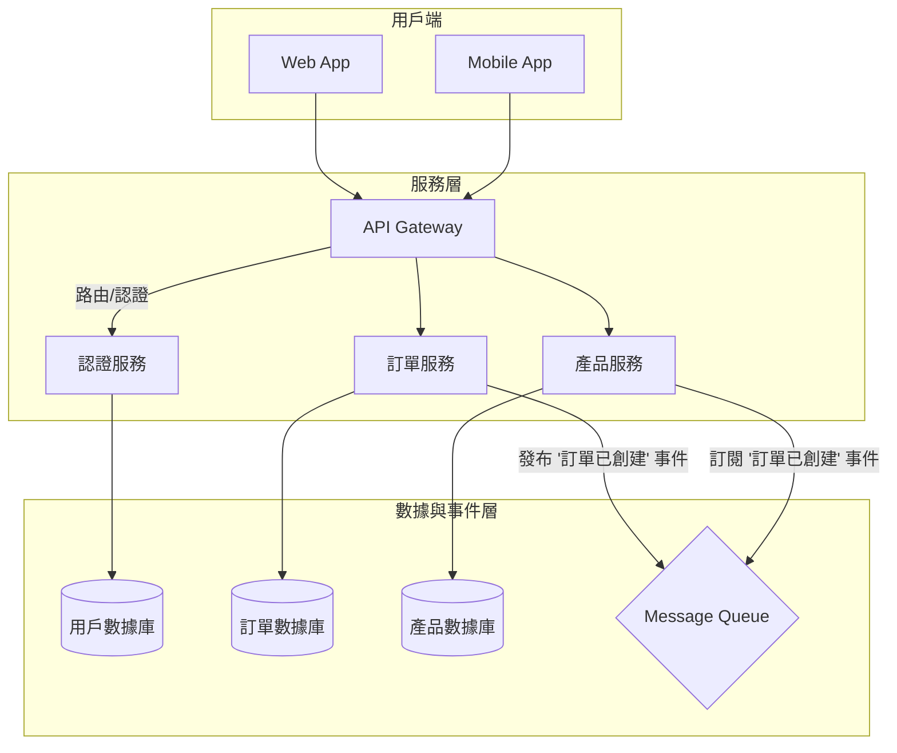

# 系統架構設計文檔 (System Architecture Document) - [專案名稱]

---

**文件版本 (Document Version):** `v1.1`

**最後更新 (Last Updated):** `YYYY-MM-DD`

**主要作者/架構師 (Lead Author/Architect):** `[請填寫]`

**審核者 (Reviewers):** `[列出主要審核人員/團隊, e.g., Architecture Review Board]`

**狀態 (Status):** `[例如：草稿 (Draft), 審核中 (In Review), 已批准 (Approved), 活躍 (Active), 已過時 (Deprecated)]`

**相關 PRD/專案簡報:** `[連結到 00_project_brief_prd_summary.md]`

**相關 ADRs:** `[列出此架構設計所依賴或產生的重要 ADR 編號, e.g., ADR-001, ADR-003]`

---

## 目錄 (Table of Contents)

1.  [引言 (Introduction)](#1-引言-introduction)
    *   [1.1 目的與範圍 (Purpose and Scope)](#11-目的與範圍-purpose-and-scope)
    *   [1.2 業務背景與價值 (Business Context and Value)](#12-業務背景與價值-business-context-and-value)
    *   [1.3 目標讀者 (Target Audience)](#13-目標讀者-target-audience)
    *   [1.4 術語表 (Glossary)](#14-術語表-glossary)
2.  [架構目標與原則 (Architecture Goals and Principles)](#2-架構目標與原則-architecture-goals-and-principles)
    *   [2.1 業務目標 (Business Goals)](#21-業務目標-business-goals)
    *   [2.2 架構目標 (Architectural Goals / Quality Attributes)](#22-架構目標-architectural-goals--quality-attributes)
    *   [2.3 設計原則 (Design Principles)](#23-設計原則-design-principles)
    *   [2.4 設計權衡 (Design Trade-offs)](#24-設計權衡-design-trade-offs)
    *   [2.5 主要制約因素與假設 (Key Constraints and Assumptions)](#25-主要制約因素與假設-key-constraints-and-assumptions)
3.  [需求摘要 (Requirements Summary)](#3-需求摘要-requirements-summary)
    *   [3.1 功能性需求摘要 (Functional Requirements Summary)](#31-功能性需求摘要-functional-requirements-summary)
    *   [3.2 非功能性需求 (Non-Functional Requirements - NFRs)](#32-非功能性需求-non-functional-requirements---nfrs)
4.  [高層次架構設計 (High-Level Architectural Design)](#4-高層次架構設計-high-level-architectural-design)
    *   [4.1 選定的架構模式 (Chosen Architectural Pattern)](#41-選定的架構模式-chosen-architectural-pattern)
    *   [4.2 系統上下文圖 (System Context Diagram)](#42-系統上下文圖-system-context-diagram)
    *   [4.3 系統組件圖 (System Component Diagram)](#43-系統組件圖-system-component-diagram)
    *   [4.4 主要組件/服務職責 (Key Components/Services Responsibilities)](#44-主要組件服務職責-key-componentsservices-responsibilities)
    *   [4.5 關鍵用戶旅程與組件交互 (Key User Journeys and Component Interactions)](#45-關鍵用戶旅程與組件交互-key-user-journeys-and-component-interactions)
5.  [技術選型詳述 (Technology Stack Details)](#5-技術選型詳述-technology-stack-details)
6.  [數據架構 (Data Architecture)](#6-數據架構-data-architecture)
    *   [6.1 數據模型 (Data Models)](#61-數據模型-data-models)
    *   [6.2 數據流圖 (Data Flow Diagrams - DFDs)](#62-數據流圖-data-flow-diagrams---dfds)
    *   [6.3 數據一致性策略 (Data Consistency Strategy)](#63-數據一致性策略-data-consistency-strategy)
    *   [6.4 數據生命週期與合規 (Data Lifecycle and Compliance)](#64-數據生命週期與合規-data-lifecycle-and-compliance)
7.  [部署與基礎設施架構 (Deployment and Infrastructure Architecture)](#7-部署與基礎設施架構-deployment-and-infrastructure-architecture)
    *   [7.1 部署視圖 (Deployment View)](#71-部署視圖-deployment-view)
    *   [7.2 CI/CD 流程 (CI/CD Pipeline)](#72-cicd-流程-cicd-pipeline)
    *   [7.3 環境策略 (Environment Strategy)](#73-環境策略-environment-strategy)
    *   [7.4 成本效益分析 (Cost-Effectiveness Analysis)](#74-成本效益分析-cost-effectiveness-analysis)
8.  [跨領域考量 (Cross-Cutting Concerns)](#8-跨領域考量-cross-cutting-concerns)
    *   [8.1 可觀測性 (Observability)](#81-可觀測性-observability)
    *   [8.2 安全性與隱私 (Security and Privacy)](#82-安全性與隱私-security-and-privacy)
9.  [風險與緩解策略 (Risks and Mitigation)](#9-風險與緩解策略-risks-and-mitigation)
10. [架構演進路線圖 (Architecture Evolution Roadmap)](#10-架構演進路線圖-architecture-evolution-roadmap)
11. [附錄 (Appendices)](#11-附錄-appendices)

---

## 1. 引言 (Introduction)

### 1.1 目的與範圍 (Purpose and Scope)
*   **目的 (Purpose):** `[為 [專案名稱] 提供一個清晰、一致的高層次架構藍圖，定義其主要組件、交互方式和技術選型，以指導後續的詳細設計和開發實施。]`
*   **範圍 (Scope):** `[明確定義本架構文檔所涵蓋的系統邊界和主要功能範圍。哪些部分在此文檔中詳細闡述，哪些部分則不包括？]`

### 1.2 業務背景與價值 (Business Context and Value)
*   **業務問題/機會 (Business Problem/Opportunity):** `[描述此專案要解決的核心業務問題或抓住的市場機會。例如：現有手動流程效率低下，錯誤率高，此系統旨在自動化... 或 市場上缺乏面向 Z 世代的 XX 工具，此專案旨在填補此空白。]`
*   **預期業務價值 (Expected Business Value):** `[量化描述專案成功後帶來的價值。例如：預計能將運營成本降低 30%，或 在第一年內獲取 10 萬名新用戶。]`
*   **與公司戰略的關聯 (Alignment with Company Strategy):** `[說明此專案如何支持公司的整體戰略目標，例如：支持公司「數位轉型」或「進入新市場」的戰略。]`

### 1.3 目標讀者 (Target Audience)
*   `[專案開發團隊、架構師、產品經理、SRE/運維團隊、安全團隊、技術主管等。]`

### 1.4 術語表 (Glossary)
| 術語/縮寫 | 完整名稱/解釋 |
| :------- | :----------- |
| `[e.g., SLA]` | `[Service-Level Agreement]` |
| `[e.g., RPO]` | `[Recovery Point Objective]` |

---

## 2. 架構目標與原則 (Architecture Goals and Principles)

### 2.1 業務目標 (Business Goals)
*   `[從 PRD 中提煉出 1-3 個最重要的業務目標，架構需要支撐這些目標。]`
    *   *目標 1: [e.g., 達到百萬級日活躍用戶 (DAU)]*
    *   *目標 2: [e.g., 將新功能的平均上線時間從 1 個月縮短到 1 週]*

### 2.2 架構目標 (Architectural Goals / Quality Attributes)
*   `[列出此架構設計旨在實現的關鍵質量屬性，這些屬性應直接支持業務目標。]`
    *   **可擴展性 (Scalability):** 系統必須能夠水平擴展以應對百萬級用戶的負載。
    *   **高可用性 (High Availability):** 核心服務的可用性需達到 99.99%。
    *   **可維護性 (Maintainability):** 模塊化設計，降低耦合度，以支持快速迭代。
    *   **安全性 (Security):** 遵循公司安全標準，保護用戶數據隱私。
    *   **成本效益 (Cost-Effectiveness):** 在滿足性能和可靠性目標的前提下，優化基礎設施成本。

### 2.3 設計原則 (Design Principles)
*   `[列出指導架構決策的核心設計原則。]`
    *   **API 優先 (API-First):** 所有功能都通過定義良好的 API 暴露。
    *   **領域驅動設計 (Domain-Driven Design):** 根據業務領域對系統進行建模和劃分。
    *   **事件驅動架構 (Event-Driven Architecture):** 服務間通過異步事件進行解耦通信。
    *   **無狀態服務 (Stateless Services):** 後端服務應設計為無狀態，以便於擴展和負載均衡。
    *   **基礎設施即代碼 (Infrastructure as Code):** 所有基礎設施均通過代碼進行管理。

### 2.4 設計權衡 (Design Trade-offs)
*   `[明確記錄在設計過程中做出的重要權衡，這對理解架構的最終形態至關重要。]`
    *   **`[權衡點 1: e.g., 性能 vs. 成本]`:** `[選擇了性能更高的託管資料庫服務，雖然成本較高，但為了滿足 <200ms 的延遲 NFR，這是必要的投資。]`
    *   **`[權衡點 2: e.g., 開發速度 vs. 技術一致性]`:** `[允許訂單服務使用 Go 語言，雖然與公司主流的 Python 技術棧不一致，但考慮到團隊在 Go 高併發處理上的經驗和該服務的性能要求，此決策有助於加快上線速度。]`
    *   **`[權衡點 3: e.g., 一致性 vs. 可用性]`:** `[在查詢場景中，我們選擇了最終一致性模型，通過異步事件更新讀取庫，這犧牲了數據的即時性，但極大地提高了讀取操作的可用性和性能。]`

### 2.5 主要制約因素與假設 (Key Constraints and Assumptions)
*   **制約因素 (Constraints):** `[列出對架構設計產生限制的因素，例如：預算、時間、已有的技術棧、合規性要求 (GDPR, CCPA)、團隊技能等。]`
*   **假設 (Assumptions):** `[列出在進行架構設計時所依賴的關鍵假設。如果這些假設不成立，可能會對設計產生重大影響。]`

---

## 3. 需求摘要 (Requirements Summary)

### 3.1 功能性需求摘要 (Functional Requirements Summary)
*   `[高度概括系統必須實現的核心功能，可直接關聯到 PRD 中的 User Stories/Features。]`
    *   `FR-1: [用戶身份驗證與管理]` (對應 US-101, US-102)
    *   `FR-2: [核心業務流程 A]` (對應 US-201, US-202)
    *   `...`

### 3.2 非功能性需求 (Non-Functional Requirements - NFRs)
*   `[詳細列出並量化關鍵的非功能性需求。這部分對架構設計至關重要。]`

| NFR 分類 | 具體需求描述 | 衡量指標/目標值 |
| :--------------- | :----------------------------------------------------------- | :---------------------------------------- |
| **性能 (Performance)** | API 端點 P95 延遲 | `< 200ms` |
| | 系統吞吐量 | `支持 10,000 TPS` |
| **可擴展性 (Scalability)** | 系統應能處理未來 2 年內預期 10 倍的用戶增長 | `支持線性擴展至 N 個節點` |
| **可用性 (Availability)** | 核心服務的年可用性 (SLA) | `99.99%` |
| **可靠性 (Reliability)** | 數據丟失容忍度 (RPO) | `RPO < 5 minutes` |
| | 恢復時間目標 (RTO) | `RTO < 30 minutes` |
| **安全性 (Security)** | 數據傳輸加密標準 | `TLS 1.3+` |
| | 身份驗證機制 | `OAuth 2.0 / JWT` |
| **合規性 (Compliance)** | 需符合 GDPR 個人數據處理要求 | `通過相關審計` |
| ... | ... | ... |

---

## 4. 高層次架構設計 (High-Level Architectural Design)

### 4.1 選定的架構模式 (Chosen Architectural Pattern)
*   **模式:** `[微服務架構 (Microservices) + 事件驅動架構 (Event-Driven Architecture)]`
*   **選擇理由:** `[詳細闡述選擇此架構模式的原因，它如何滿足專案的架構目標和 NFRs？與其他備選模式 (如模塊化單體) 的比較和權衡是什麼？(可引用相關 ADR)]`

### 4.2 系統上下文圖 (System Context Diagram)
*   `[使用圖表 (建議 Mermaid) 展示系統與外部用戶、其他系統的交互邊界。]`

### 4.3 系統組件圖 (System Component Diagram)
*   `[使用圖表 (建議 Mermaid) 展示系統的高層次組件/微服務及其相互關係。圖中應標明主要組件、接口和關鍵的數據流向。]`

*   `[對圖中各組件和連接進行簡要文字說明。]`

### 4.4 主要組件/服務職責 (Key Components/Services Responsibilities)
| 組件/服務名稱 | 核心職責 | 主要技術/框架 | 依賴 |
| :-------------------- | :-------------------------------------------------------- | :------------------- | :-------------------- |
| `API Gateway` | `請求路由、負載均衡、認證、速率限制` | `[e.g., Kong, Nginx]` | `AuthService` |
| `認證服務` | `處理用戶註冊、登入、Token 管理` | `[e.g., FastAPI, JWT]` | `UserDB` |
| `訂單服務` | `管理訂單生命週期，發布領域事件` | `[e.g., Go, gRPC]` | `OrderDB`, `MessageQueue` |
| `...` | `...` | `...` | `...` |

### 4.5 關鍵用戶旅程與組件交互 (Key User Journeys and Component Interactions)
*   `[用文字描述幾個核心的用戶場景，並說明數據和控制流如何在主要組件之間傳遞。這有助於非技術人員理解系統如何工作。]`
    *   **場景 1: 用戶註冊流程**
        1.  **用戶** 通過 **Web App** 提交註冊信息。
        2.  **API Gateway** 接收請求，並將其路由到 **認證服務 (AuthService)**。
        3.  **認證服務** 驗證數據，將用戶信息寫入 **用戶數據庫 (UserDB)**。
        4.  **認證服務** 生成 JWT Token 並返回給用戶。
    *   **場景 2: 創建訂單流程**
        1.  **用戶** 通過 **Mobile App** 發起下單請求。
        2.  **API Gateway** 驗證 Token 後，將請求路由到 **訂單服務 (OrderService)**。
        3.  **訂單服務** 處理業務邏輯，將訂單數據寫入 **訂單數據庫 (OrderDB)**。
        4.  **訂單服務** 發布一條 `訂單已創建` 事件到 **消息隊列 (Message Queue)**。
        5.  **產品服務 (ProductService)** 訂閱此事件，並更新商品庫存。

---

## 5. 技術選型詳述 (Technology Stack Details)

### 5.1 技術選型原則 (Technology Selection Principles)
*   `[在列出具體技術之前，先闡明指導我們進行技術選型的核心原則。]`
    *   **優先選擇託管服務 (Prefer Managed Services):** `[盡可能使用雲端供應商提供的託管服務 (如 AWS RDS, EKS)，以降低運維複雜度和成本。]`
    *   **基於團隊現有技能 (Align with Team Expertise):** `[在滿足需求的前提下，優先選擇團隊熟悉且有生產經驗的技術棧，以提高開發效率。]`
    *   **擁抱開源與成熟社群 (Embrace Open-Source & Mature Communities):** `[優先選擇擁有活躍社群和良好文檔的開源技術，以確保長期的可維護性和問題解決能力。]`
    *   **考慮總體擁有成本 (Consider Total Cost of Ownership - TCO):** `[評估不僅包括授權費用，還包括學習、開發、運維和擴展的隱形成本。]`
    *   **性能與需求的匹配 (Match Performance with Requirements):** `[不過度設計，選擇能夠滿足當前及可預見未來性能需求的技術，避免過早優化。]`

### 5.2 技術棧詳情 (Technology Stack Breakdown)
*   `[詳細闡述在各個方面選擇的具體技術、框架或服務。每個重要選型最好能對應到一個 ADR。]`

| 分類 | 選用技術 | 選擇理由 (Justification) | 考量的備選方案 (Alternatives) | 風險/成熟度 | 相關 ADR |
| :--- | :--- | :--- | :--- |:--- |:--- |
| **後端框架** | `[Python/FastAPI, Go/Gin]` | `[FastAPI 的高性能異步特性和自動文檔生成能力非常適合構建面向外部的 API。Go 的併發性能和低資源佔用使其成為構建核心業務微服務的理想選擇。]` | `[Node.js/Express]: 團隊對 TS 熟悉，但 Go 在 CPU 密集型任務上表現更佳。 [Java/Spring Boot]: 生態成熟但啟動慢，資源消耗較大。` | `成熟 (Mature)` | `[ADR-001]` |
| **資料庫** | `[PostgreSQL (主要), Redis (快取)]` | `[PostgreSQL 的穩定性、事務支持和豐富的查詢功能滿足了大多數業務場景。Redis 用於緩存熱點數據，降低資料庫負載。]` | `[MySQL]: 功能相似，但團隊對 PostgreSQL 的 JSONB 和地理空間支持有更多經驗。 [MongoDB]: 適合非結構化數據，但本場景需要強事務保證。` | `成熟 (Mature)` | `[ADR-002]` |
| **訊息佇列** | `[Kafka]` | `[Kafka 的高吞吐量、持久性和可擴展性使其能夠作為系統異步通信和事件溯源的核心。]` | `[RabbitMQ]: 更適合複雜的路由規則，但 Kafka 在日誌和事件流處理上生態更強。 [AWS SQS]: 託管服務，簡單易用，但吞吐量和功能不及 Kafka。` | `成熟 (Mature)` | `[ADR-003]` |
| **容器編排** | `[Kubernetes (EKS)]` | `[K8s 已成為容器編排的行業標準，提供了強大的服務發現、自動擴展和自我修復能力。選擇 EKS 可以降低管理複雜度。]` | `[AWS ECS]: 更簡單，與 AWS 生態集成更好，但 K8s 的跨雲能力和社群支持更具優勢。 [Nomad]: 更輕量，但生態系統相對較小。` | `成熟 (Mature)` | `[ADR-004]` |
| **可觀測性** | `[Prometheus, Grafana, Jaeger, Loki]` | `[選擇開源的 CNCF 標準工具棧，便於社區支持和未來擴展，避免廠商鎖定。]` | `[Datadog/New Relic]: 商業 SaaS 方案，功能強大，開箱即用，但成本較高且有數據鎖定風險。]` | `成熟 (Mature)` | `[ADR-005]` |
| **CI/CD** | `[GitHub Actions]` | `[與我們的代碼倉庫無縫集成，配置簡單，擁有豐富的社區 Actions 可供使用。]` | `[Jenkins]: 功能強大靈活，但配置和維護複雜度較高。 [GitLab CI]: 功能強大，但需要遷移代碼倉庫。` | `成熟 (Mature)` | |

---

## 6. 數據架構 (Data Architecture)

### 6.1 數據模型 (Data Models)
*   `[描述核心業務實體的數據模型及其關係。可以使用 ER 圖。]`

### 6.2 數據流圖 (Data Flow Diagrams - DFDs)
*   `[針對系統中的關鍵數據流 (例如：用戶註冊流程、下單流程)，使用 DFD 來描述數據的來源、去向、處理過程和儲存。]`

### 6.3 數據一致性策略 (Data Consistency Strategy)
*   `[在分散式系統中，明確數據一致性策略至關重要。]`
    *   **需要強一致性的場景:** `[例如：用戶帳戶餘額]` -> `[採用兩階段提交或分佈式事務]`
    *   **可接受最終一致性的場景:** `[例如：用戶操作日誌]` -> `[通過異步消息隊列實現]`

### 6.4 數據生命週期與合規 (Data Lifecycle and Compliance)
*   **數據分類 (Data Classification):** `[對系統處理的數據進行分類，例如：公開數據、內部數據、機密數據、個人身份信息 (PII)。]`
*   **數據儲存與加密 (Data Storage and Encryption):** `[描述不同分類的數據儲存方案，以及靜態加密 (at-rest) 和傳輸中加密 (in-transit) 的策略。]`
*   **數據保留策略 (Data Retention Policy):** `[根據業務需求和法律法規 (如 GDPR)，定義不同類型數據的保留期限和清理機制。]`
*   **合規性考量 (Compliance Considerations):** `[如果涉及特定行業或地區的法規 (如 HIPAA, PCI-DSS)，在此說明架構如何滿足這些要求。]`

---

## 7. 部署與基礎設施架構 (Deployment and Infrastructure Architecture)

### 7.1 部署視圖 (Deployment View)
*   `[使用圖表 (建議 Mermaid) 描述物理或虛擬機器的拓撲結構，以及服務如何部署到這些節點上。]`

### 7.2 CI/CD 流程 (CI/CD Pipeline)
*   `[描述從代碼提交到生產部署的自動化流程。]`

### 7.3 環境策略 (Environment Strategy)
*   `[描述不同環境 (如 Development, Staging, Production) 的設置和隔離策略。]`

### 7.4 成本效益分析 (Cost-Effectiveness Analysis)
*   **主要成本驅動因素 (Key Cost Drivers):** `[識別基礎設施中的主要成本來源，例如：計算資源 (EC2/K8s nodes)、託管資料庫、數據傳輸、日誌儲存等。]`
*   **成本估算模型 (Cost Estimation Model):** `[提供一個基於預期負載的初步成本估算。例如：基於 100 萬用戶，每月預估成本為 $XXXX。]`
*   **成本優化策略 (Cost Optimization Strategies):** `[列出計劃採用的成本優化措施，例如：使用 Spot 實例、自動伸縮 (Autoscaling)、資源預留 (Reserved Instances)、數據分層存儲等。]`

---

## 8. 跨領域考量 (Cross-Cutting Concerns)

### 8.1 可觀測性 (Observability)
*   **日誌 (Logging):** `[日誌格式標準 (e.g., JSON)、集中收集方案 (e.g., Fluentd -> Loki)、日誌輪換與保留策略。]`
*   **指標 (Metrics):** `[核心 SLI/SLO 指標定義、監控儀表板 (Dashboard) 設計原則。]`
*   **追蹤 (Tracing):** `[全鏈路追蹤的實現方案 (e.g., OpenTelemetry)，Trace ID 傳遞機制。]`
*   **告警 (Alerting):** `[告警分級策略 (e.g., P1/P2)、通知渠道、On-call 輪值機制。]`

### 8.2 安全性與隱私 (Security and Privacy)
*   **威脅模型 (Threat Model):** `[識別主要的攻擊面和潛在威脅 (STRIDE模型)。]`
*   **認證與授權:** `[詳細描述服務間和用戶到服務的認證授權機制。]`
*   **機密管理:** `[Secrets (密碼, API Keys) 的儲存和分發方案 (e.g., HashiCorp Vault)。]`
*   **網路安全:** `[VPC 劃分、安全組規則、WAF 配置等。]`
*   **隱私設計 (Privacy by Design):** `[闡述系統如何從設計之初就考慮用戶隱私保護，例如：數據最小化原則、匿名化/假名化技術的應用。]`

---

## 9. 風險與緩解策略 (Risks and Mitigation)

| 風險類別 | 風險描述 | 可能性 (高/中/低) | 影響程度 (高/中/低) | 緩解策略 |
| :------- | :------- | :---------------- | :---------------- | :------- |
| **技術風險** | `[Kafka 集群運維複雜度高，團隊經驗不足]` | 中 | 高 | `[採用託管 Kafka 服務 (e.g., Confluent Cloud)，安排內部培訓和 PoC。]` |
| **依賴風險** | `[依賴的第三方支付服務 SLA 不穩定]` | 中 | 中 | `[設計斷路器和降級方案，在支付失敗時提供備選支付方式或提示用戶稍後重試。]` |
| **執行風險** | `[微服務拆分過細，導致開發和調試困難]` | 高 | 中 | `[初期採用較粗粒度的服務劃分 (模塊化單體)，待業務邊界清晰後再逐步拆分。]` |

---

## 10. 架構演進路線圖 (Architecture Evolution Roadmap)
*   `[討論系統在當前版本之後可能的發展方向、潛在的增強功能或架構演進路徑，並以階段性目標呈現。]`
*   **Phase 1 (MVP - 3 個月內):** `[實現核心的用戶註冊和訂單功能，驗證核心業務模式。架構上優先保證穩定性和快速上線。]`
*   **Phase 2 (擴展期 - 6-12 個月):** `[引入產品推薦服務，數據架構上引入數據倉儲進行 BI 分析。考慮引入服務網格 (Service Mesh) 來標準化服務間通信。]`
*   **Phase 3 (成熟期 - 1 年後):** `[探索多區域部署以提升全球用戶體驗和容災能力。考慮將日誌和指標系統遷移到更具成本效益的方案。]`

---

## 11. 附錄 (Appendices)
*   `[任何補充材料，如詳細的成本估算、PoC 報告等。]`

---
**文件審核記錄 (Review History):**

| 日期       | 審核人     | 版本 | 變更摘要/主要反饋 |
| :--------- | :--------- | :--- | :---------------- |
| YYYY-MM-DD | [姓名/團隊] | v0.1 | 初稿提交          |
| YYYY-MM-DD | [姓名/團隊] | v0.2 | 根據反饋更新      | 