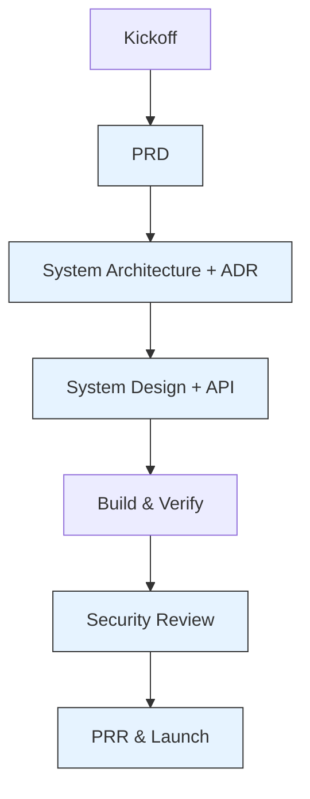
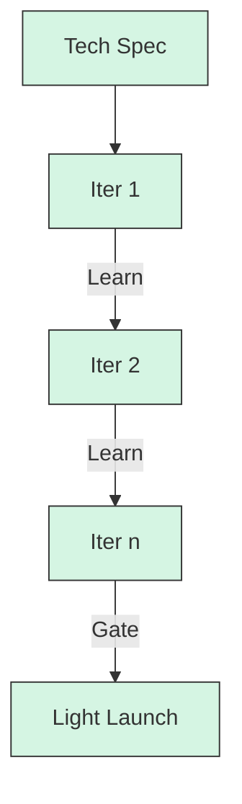

# 產品開發流程使用說明書（Dual-Mode：完整流程 / MVP）

本文件提供兩種可操作的產品研發流程模式：
- 模式 A：完整流程（適用於核心業務、跨團隊協作、合規/安全要求高的專案）
- 模式 B：MVP 快速迭代（適用於探索性、高不確定性、需快速驗證假設的專案）

兩種模式共享統一的文檔模板體系，但在交付粒度、審查嚴謹度、節奏上有所差異。每個階段均定義了目標、輸入、產出、RACI、Gate 準入/準出與度量指標，確保可落地與可檢核。

---

## 1. 使用原則（適用於兩種模式）

- 以文檔為契約：所有決策以文檔為單一事實來源（SSOT）。
- 小步快跑、可回溯：優先小批量交付，保留 ADR 以利回溯決策脈絡。
- 風險前置、代價後置：在投入大量開發前，用審查 Gate 降低重大偏差風險。
- 模式可升降級：MVP 模式可在風險上升/範圍擴大時升級為完整流程；完整流程在低風險子專案可降級為 MVP。

角色縮寫（RACI）：
- PM（產品經理）、TL（技術負責人）、ARCH（架構師）、DEV、QA、SRE、SEC（安全/隱私）、OPS、DATA

模板路徑（範例）：
- `開發遵循文件/00_project_brief_prd_summary_template.md`
- `開發遵循文件/01_adr_template.md`
- `開發遵循文件/02_system_architecture_document_template.md`
- `開發遵循文件/03_system_design_document_template.md`
- `開發遵循文件/04_api_design_specification_template.md`
- `開發遵循文件/05_security_privacy_review_checklist_template.md`
- `開發遵循文件/06_production_readiness_review_template.md`
- `開發遵循文件/07_project_structure_template.md`

---

## 2. 模式選擇建議與升級規則

- 建議使用完整流程若：涉及金流/法遵/隱私資料、高可用與規模化要求、跨 3+ 團隊協作、需長期維運。
- 建議使用 MVP 若：需快速驗證價值假設、時間/預算有限、功能邊界清晰、可容忍較高風險與手動運維。
- 升級準則（MVP -> 完整）：任一事件觸發升級：
  - 觸及敏感資料或外部合規約束
  - 月活/交易量預估超過既有閾值（例如 DAU > 10k 或 TPS > 100）
  - 引入新服務/資料庫/對外 API 或多團隊協作
  - 產品定位由探索性轉為核心營收/關鍵運營

---

## 3. 模式 A：完整流程（Full Process）

### A0 啟動與對齊（Kickoff）
- 目標：對齊商業目標、成功指標、邊界與風險；建立規範與節奏。
- 輸入：商業構想、既有研究、競品分析
- 產出：
  - 啟動簡報、里程碑與資源規劃
  - 文檔規範與模板鏈接、版本策略
- RACI：PM R、TL/ARCH A、各團隊 C/I
- Gate（準出）：利益相關者對里程碑/風險/溝通節奏達成共識

### A1 構想與規劃（PRD）
- 目標：定義問題、受眾、範圍、成功指標與里程碑
- 輸入：Kickoff 輸出、商業策略
- 產出：`00_project_brief_prd_summary_template.md`
- 主要活動：價值主張、需求分解、KPI、風險與依賴
- RACI：PM R/A、TL/ARCH/QA/OPS/SRE/SEC/DATA C、DEV I
- Gate：PRD 已審核簽核；KPI 可量測且與業務對齊

### A2 高層次架構（SA + ADR）
- 目標：確立系統邊界、架構模式、技術選型、NFR；記錄關鍵決策
- 輸入：PRD、現況系統/資源盤點
- 產出：
  - `02_system_architecture_document_template.md`
  - `01_adr_template.md`（多份，隨決策累積）
- 主要活動：上下文/組件/部署與資料架構、設計權衡、關鍵用戶旅程
- RACI：ARCH R/A、TL R、PM/SRE/SEC/OPS C、DEV/QA I
- Gate：核心 ADR 齊備且權衡明確；NFR 可被驗證；風險與緩解策略明列

### A3 詳細設計（SDD + API）
- 目標：把 SA 轉化為可實作規格與契約
- 輸入：SA、ADR、資料字典
- 產出：
  - `03_system_design_document_template.md`（各模組）
  - `04_api_design_specification_template.md`（對外/對內 API）
  - `07_project_structure_template.md`（目錄/模組規範）
- 主要活動：資料模型與索引策略、內外部介面、流程圖、錯誤與可觀測性方案
- RACI：TL R/A、DEV/ARCH R、QA/SRE/SEC C、PM I
- Gate：介面契約穩定、測試策略完整、回滾與相容性考量完備

### A4 開發與驗證（Build & Verify）
- 目標：可交付、可測試、可回滾的增量交付
- 輸入：SDD、API Spec、Backlog
- 產出：程式碼、測試、建置產物、變更紀錄
- 主要活動：CI/CD、單元/整合/E2E 測試、性能預檢、資安依賴掃描
- RACI：DEV R、TL/QA A、SRE/SEC/OPS C、PM I
- Gate：測試綠燈、Coverage 達標、性能/資安閾值過關

### A5 安全與隱私審查（Security & Privacy Review）
- 目標：在上線前消除高風險弱點與隱私風險
- 輸入：SA/SDD/API、風險登記、掃描報告
- 產出：`05_security_privacy_review_checklist_template.md`（完成的審查清單與整改項）
- RACI：SEC R/A、TL/DEV/SRE C、PM/OPS I
- Gate：高/中風險已整改或有替代方案；威脅模型與資料保護措施完備

### A6 生產就緒審查與上線（PRR & Launch）
- 目標：確保可靠性、可觀測性、運維準備就緒
- 輸入：運維手冊、監控儀表板、回滾計畫、災難演練結果
- 產出：`06_production_readiness_review_template.md`（簽核）
- RACI：SRE/OPS R/A、TL/DEV/QA/SEC C、PM I
- Gate：SLO/Alert 就緒；回滾與備援演練通過；Go/No-Go 簽核

### A* 跨階段：變更管理與文件治理
- 變更需更新 ADR 與相依文檔；重大變更需重過 Gate。
- 文檔版本策略：語義化版本 + 變更日誌；關聯 PR/Issue。

---

## 4. 模式 B：MVP 快速迭代（Lean）

### B0 Sprint 0：範圍界定與 Tech Spec
- 目標：最小可行閉環、最快驗證路徑
- 輸入：商業假設、用戶洞察、限制條件
- 產出：一份輕量 `Tech Spec`（合併 PRD/SA/SDD/API 的最小集合）
- 主要內容：
  - 問題/目標用戶/成功指標（最多 3 條）
  - 高層設計一句話 + 1 張組件圖
  - 必要 API 契約（僅核心端點）
  - 1-2 張資料表 Schema
  - 風險與手動替代方案（Runbook 級）
- RACI：PM/TL R/A、DEV/QA/SRE C、其餘 I
- Gate：Tech Spec 被團隊認可；估算與時程可落地

### B1-Bn 迭代循環
- 每次迭代固定交付：可運行版本 + 指標驗證 + 回顧
- 迭代內活動：
  - 設計/實作/測試同步進行；必要時補充簡短 ADR
  - 最低限度安全檢查（Secrets、認證、輸入驗證）
  - 最低限度可觀測性（日誌、基本健康檢查）
- Gate：
  - 端到端用戶路徑可跑通
  - Bug/風險在可接受閾值內
  - 指標達成或產生明確學習（可迭代調整）

### Bx MVP 上線 Gate
- 條件：
  - 有最小可運營 Runbook（部署、監控、回滾步驟）
  - 數據備份已啟用；關鍵日誌可查
  - 風險與債務列入後續 Backlog 與升級評估

升級提示：出現「敏感資料/規模擴大/跨團隊/合規」任一情形，即刻評估升級至「完整流程」。

---

## 5. 文檔產出清單與模板映射

| 階段 | 模式 A（完整） | 模式 B（MVP） |
| :-- | :-- | :-- |
| 啟動 | Kickoff 簡報、里程碑 | 迭代計畫草案 |
| 規劃 | `00_project_brief_prd_summary_template.md` | Tech Spec 的 PRD 區塊 |
| 架構 | `02_system_architecture_document_template.md`、`01_adr_template.md` | Tech Spec 的 SA/ADR 區塊 |
| 設計 | `03_system_design_document_template.md`、`04_api_design_specification_template.md`、`07_project_structure_template.md` | Tech Spec 的 SDD/API/結構區塊 |
| 安全 | `05_security_privacy_review_checklist_template.md` | 簡化安全檢查清單 |
| 上線 | `06_production_readiness_review_template.md` | 輕量 Launch Checklist |

---

## 6. Gate 準入/準出與度量（兩種模式通用）

- 準入（每階段必備）：輸入文檔完整性、角色對齊、風險已登記
- 準出（才能進下一階段）：產出文檔完成度 ≥ 90%、審查簽核、關鍵指標可驗證
- 共同度量：
  - 需求穩定度（變更率）、缺陷密度、交付節奏（Lead Time / Cycle Time）
  - 上線後 SLO 達成率、回滾頻次、事故 MTTR

---

## 7. 附錄：檢查清單（摘錄）

- PRD：是否有明確的問題陳述、非目標、量化 KPI？
- 架構：是否記錄權衡與 ADR？NFR 是否可測？
- 設計：資料模型/索引、API 契約、錯誤處理、可觀測性是否具體？
- 安全：Secrets 管理、認證授權、輸入驗證、依賴風險是否已覆蓋？
- 上線：備份、監控、告警、回滾方案與演練是否到位？

---

本文件可作為評審與交付的「操作指南」。若無特別說明，預設採「模式 A：完整流程」，並允許在子模組/探索階段採用「模式 B：MVP」，但需明確標注並保留升級機制。
